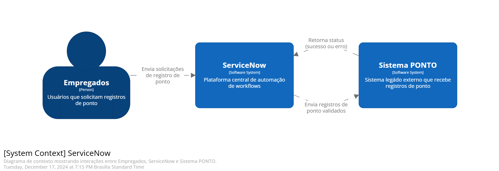
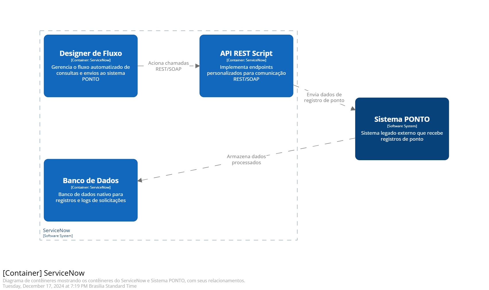
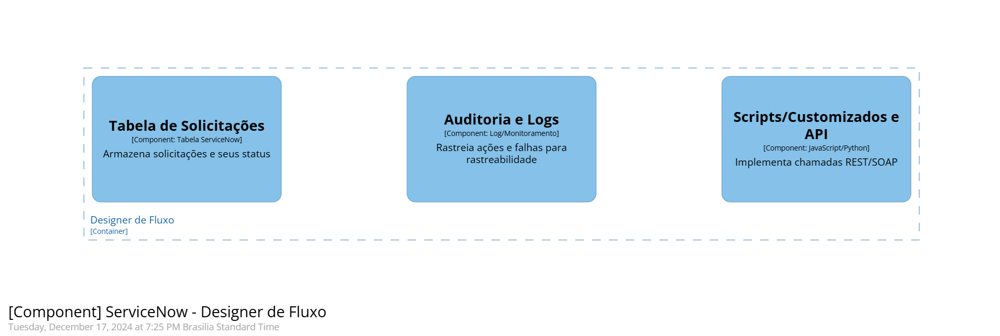
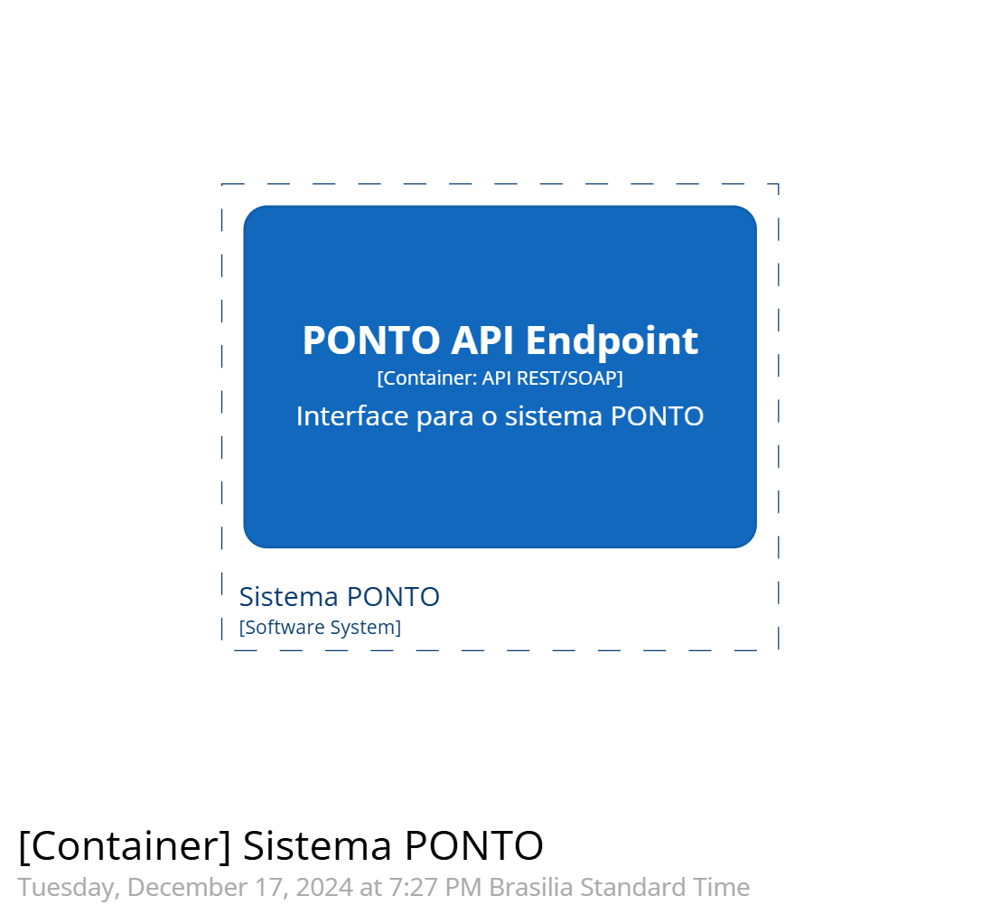
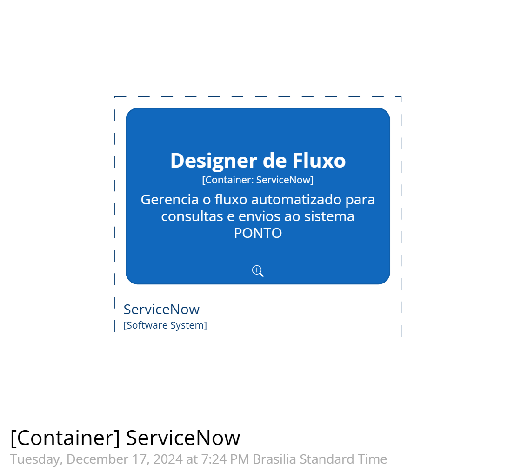
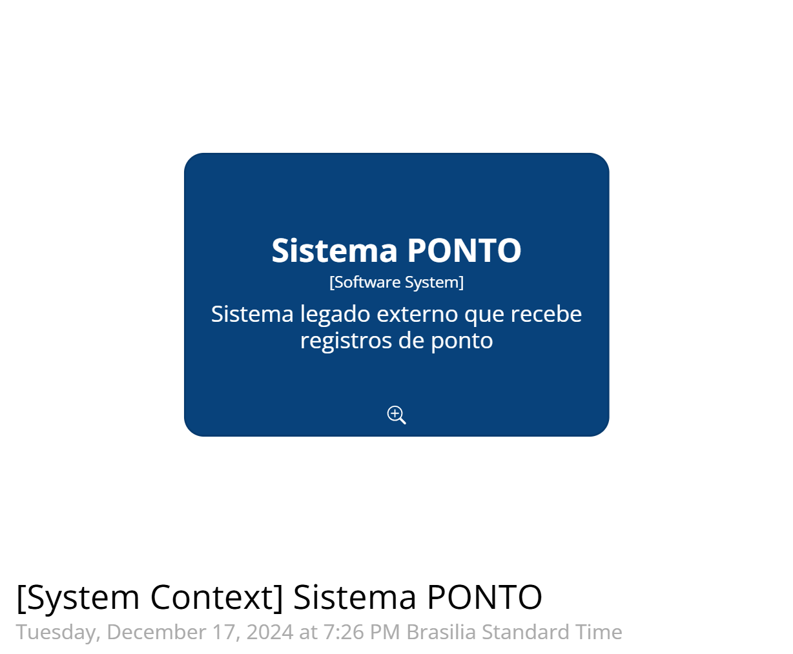
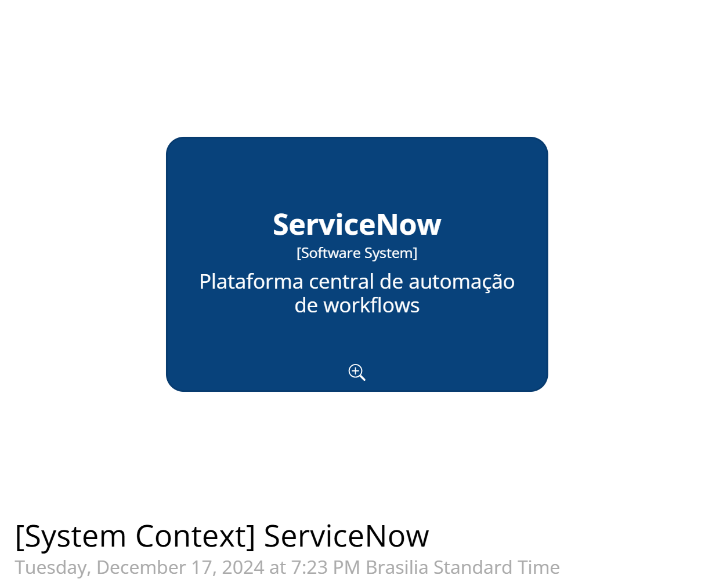
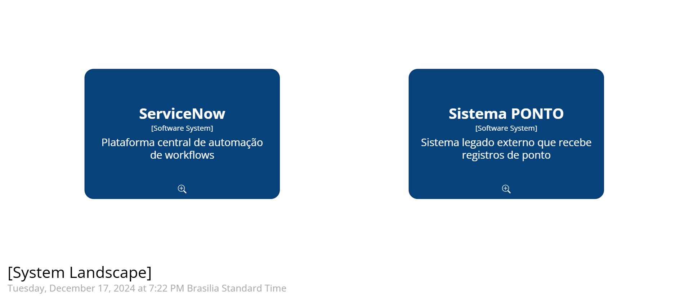

# Modelo C4 - Documentação

## 2.1. Nível 1 - Contexto

O principal fluxo de interação ocorre entre o **ServiceNow** (plataforma de gestão de requisições) e o **Sistema PONTO** (legado), onde registros de ponto são validados, processados e enviados.

### Participantes:
- **ServiceNow**: Plataforma central de automação de fluxos de trabalho.
- **Funcionários**: Usuários que solicitam registros de ponto.
- **Sistema PONTO**: Sistema legado externo que recebe as submissões de ponto.

---

## 2.2. Nível 2 - Contêineres

### ServiceNow:
1. **Flow Designer**: Gerencia os fluxos de automação para consultas e submissões ao sistema PONTO.
2. **Scripted REST API**: Implementa endpoints personalizados para comunicação via REST/SOAP.
3. **Banco de Dados**: Banco de dados nativo do ServiceNow para registros e logs de requisições.

### Sistema PONTO:
1. **REST/SOAP API**: Interface para consultas e envio de dados de ponto.

### Ferramenta de Monitoramento (Opcional):
- **Analytics de Desempenho** ou integração com **Splunk/Datadog** para monitoramento de logs e status.

---

## 2.3. Nível 3 - Componentes

### Componentes e suas funções:
| **Componente**            | **Função**                                         |
|----------------------------|--------------------------------------------------|
| **Flow Designer**          | Gerencia fluxos de trabalho para consultas e submissões. |
| **Custom Scripts/API**     | Implementa chamadas REST/SOAP.                   |
| **Auditoria e Logs**       | Rastreia ações e falhas para fins de rastreabilidade. |
| **Tabela de Requisições**  | Armazena requisições e seus respectivos status.  |
| **Endpoint da API PONTO**  | Interface com o sistema PONTO.                   |

### Diagramas:
#### Componentes no ServiceNow - Flow Designer:

#### Container: PONTO API Endpoint:

#### Container: ServiceNow Flow Designer:

---

## Resumo do Fluxo:
1. Os **Funcionários** submetem registros de ponto via **ServiceNow**.
2. O **Flow Designer** do ServiceNow aciona chamadas **REST/SOAP** via **Custom Scripts/API**.
3. Os dados são enviados para o **Sistema PONTO**, que valida e armazena os registros.
4. O **Banco de Dados** no ServiceNow armazena logs e registros processados.
5. Logs opcionais podem ser monitorados com a **Ferramenta de Monitoramento**.

---

## Visão do Sistema e Fluxos
### Contexto do Sistema:
- **ServiceNow**: Centraliza a automação de requisições.
- **Sistema PONTO**: Recebe as submissões de ponto.

---

## Fluxo Completo
### Diagrama de Interação

