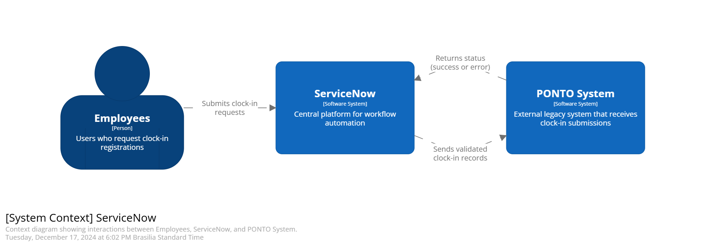
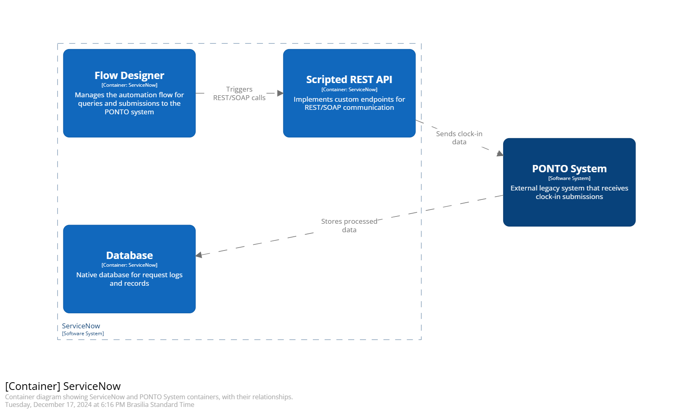
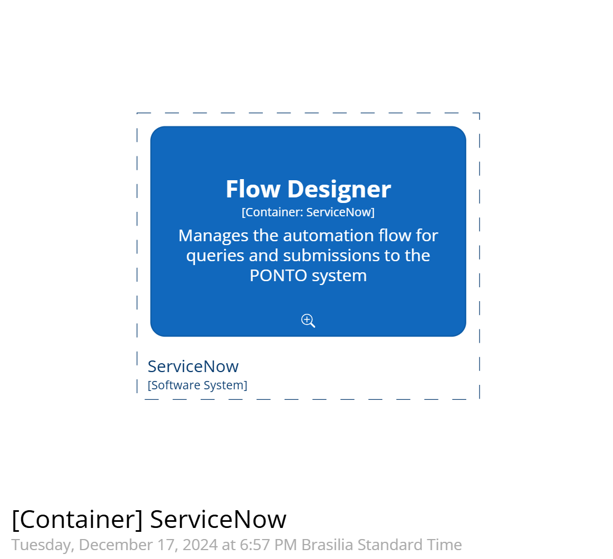
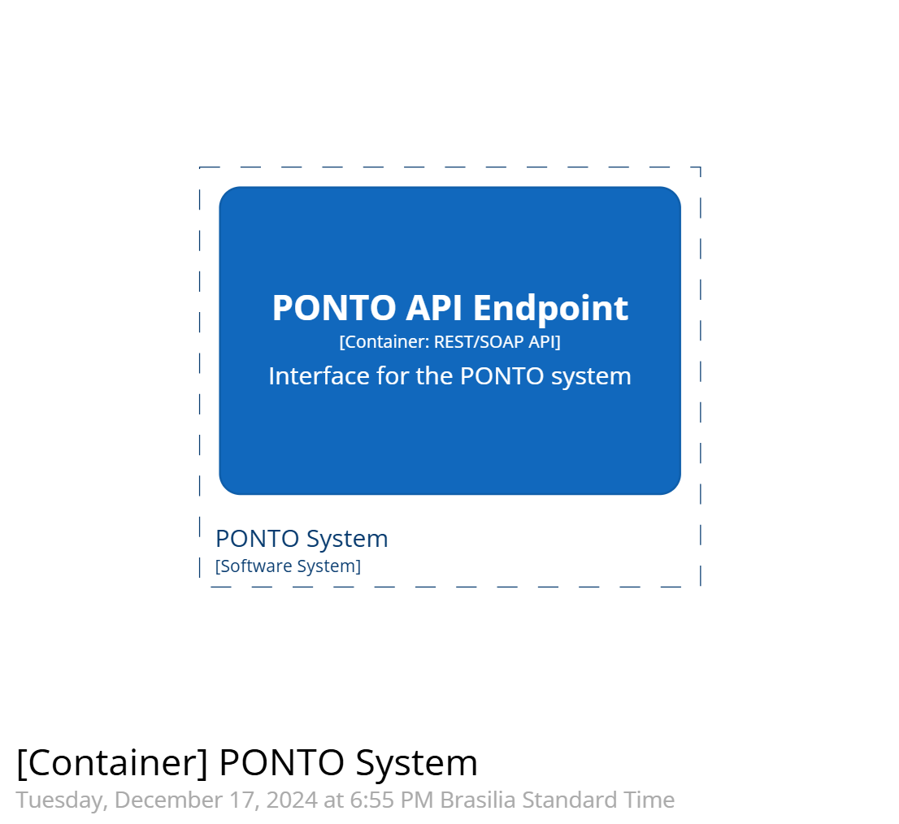
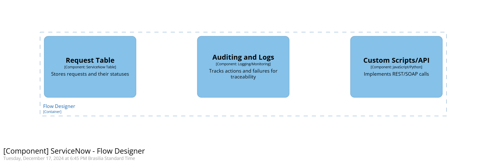
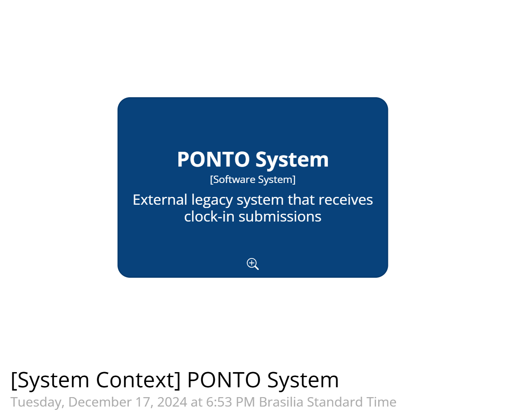
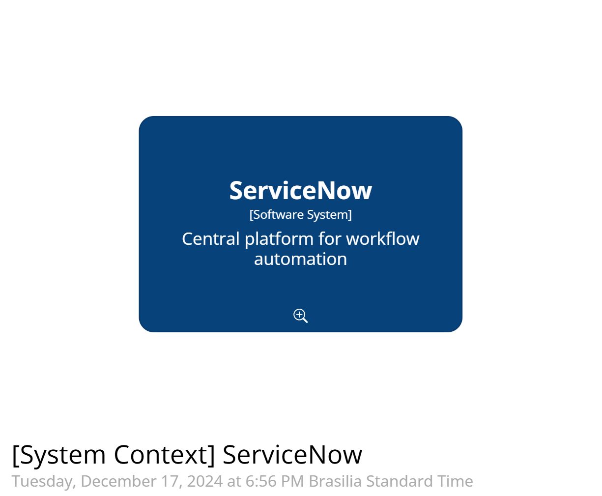

# C4 Model

## 2.1. Level 1 - Context
### Description:
The context level shows the main interactions between **ServiceNow**, the **PONTO System**, and **Employees**.

- **ServiceNow**: Central platform for workflow automation.
- **Employees**: Users who request clock-in registrations.
- **PONTO System**: External legacy system that receives clock-in submissions.

### Diagram:

---

## 2.2. Level 2 - Containers
### Description:
The containers detail the systems and their main components.

#### **ServiceNow**:
1. **Flow Designer**: Manages automation workflows for querying and submitting to the PONTO system.
2. **Scripted REST API**: Implements custom endpoints for REST/SOAP communication.
3. **Database**: ServiceNow's native database for request logs and records.

#### **PONTO System**:
- **REST/SOAP API**: Interface for querying and submitting clock-in data.

#### **Monitoring Tool (Optional)**:
- **Performance Analytics** or integration with **Splunk/Datadog** for status and log monitoring.

### Diagrams:
1. **ServiceNow and PONTO System - Containers**  

2. **Flow Designer - Detail**  

3. **PONTO System - Detail**  

---

## 2.3. Level 3 - Components
### Description:
Details of individual components and their functions.

| **Component**          | **Function**                                           |
|-------------------------|--------------------------------------------------------|
| **Flow Designer**       | Manages workflows for querying and submissions.       |
| **Custom Scripts/API**  | Implements REST/SOAP calls.                           |
| **Auditing and Logs**   | Tracks actions and failures for traceability.         |
| **Request Table**       | Stores requests and their statuses.                   |
| **PONTO API Endpoint**  | Interface for the PONTO system.                       |

### Diagrams:
1. **Components - ServiceNow - Flow Designer**  

2. **Components - ServiceNow and PONTO System**  

3. **System Context**  
  

---

## Summary:
- **Level 1**: Shows the relationship between users and the main systems.
- **Level 2**: Details the containers within the systems.
- **Level 3**: Focuses on the internal components and their responsibilities.

---